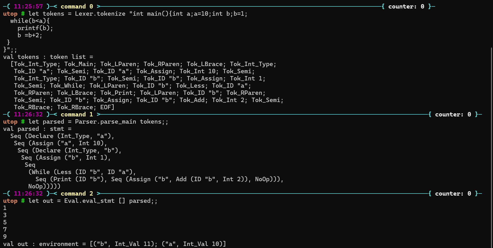

# e-proftfolio
My name is Patrick Syme. I'm a student studying Computer Science at the University of Maryland. This is my second year studying at UMD, after studying Computer Science at Montgomery College for two years. 
While studying at UMD, I have programmed many projects, both for class and extracurricular, but three I would like to highlight are a C interpreter written in OCaml, a custom malloc project in C, and a voting system simulator. 
 
